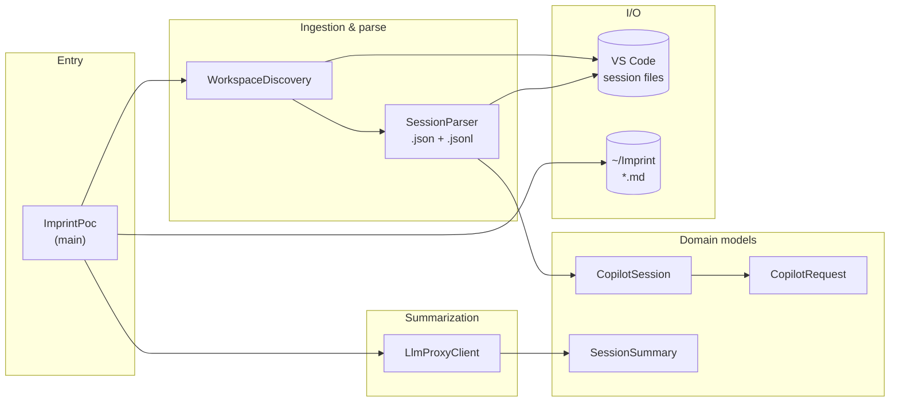
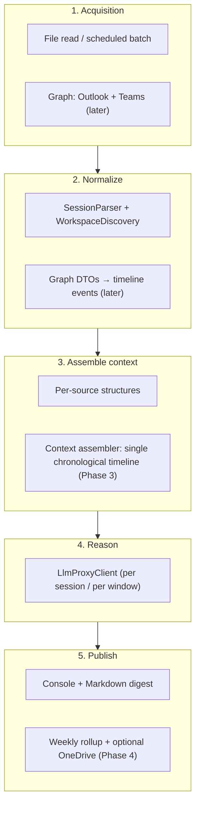
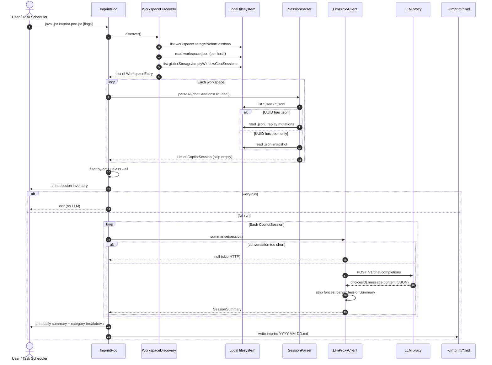
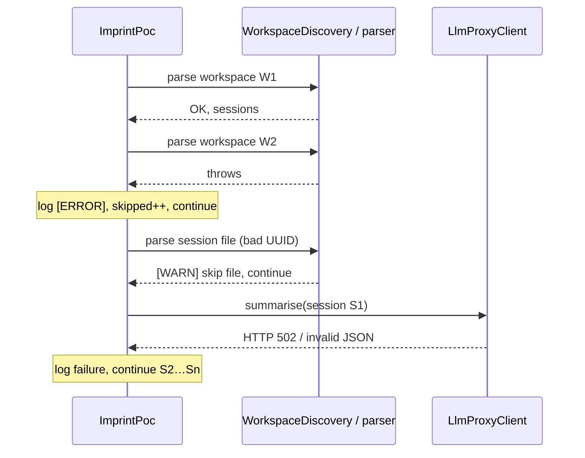
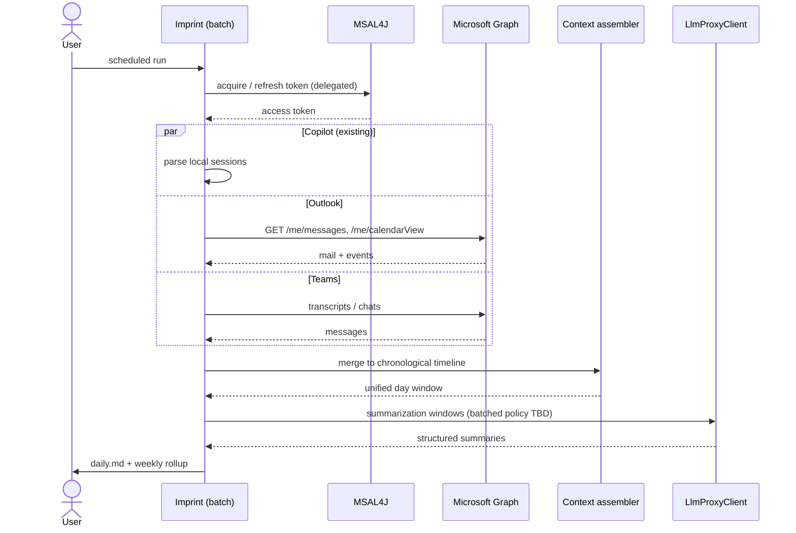
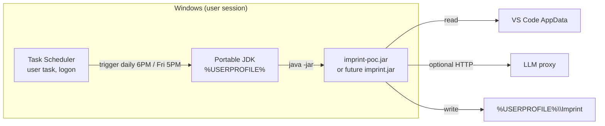

# Imprint — Architecture diagrams

This document uses [Mermaid](https://mermaid.js.org/) (renders in GitHub, many IDEs, and Markdown preview). It reflects the POC / requirements: **Phase 1** is Copilot-only; **Phases 2–4** add Microsoft Graph, merging, and scheduling.

---

## 1. High-level system context (end-state vision)

Context for all phases: local execution, no central server in the baseline design.

```mermaid
flowchart TB
    subgraph Sources["Data sources (digital exhaust)"]
        CP["GitHub Copilot chat<br/>%APPDATA%\\Code\\User\\…\\chatSessions"]
        OL["Microsoft Outlook<br/>Graph: mail, calendar"]
        TM["Microsoft Teams<br/>Graph: transcripts / chat"]
    end

    subgraph Runtime["On-device runtime"]
        IMP["Imprint<br/>(fat JAR, batch)"]
    end

    subgraph External["External services"]
        PROXY["LLM proxy<br/>(OpenAI-compatible)"]
        LLM["Upstream model<br/>(e.g. via GitHub Models)"]
        GRAPH["Microsoft Graph API"]
    end

    subgraph Outputs["Outputs"]
        MD["Markdown reports<br/>%USERPROFILE%\\Imprint\\"]
        OD["Optional: OneDrive<br/>(Graph upload)"]
    end

    CP -->|read files| IMP
    OL -->|OAuth + REST| GRAPH
    TM -->|OAuth + REST| GRAPH
    GRAPH -->|fetch| IMP
    IMP -->|HTTP POST /v1/chat/completions| PROXY
    PROXY --> LLM
    IMP --> MD
    IMP -.->|Phase 4| OD
```



---

## 2. Phase 1 — logical components (inside the JAR)



---

## 3. Full pipeline (roadmap) — layered view

Matches the POC processing pipeline; **Phase 1** implements the left branch through LLM + report for Copilot only.



---

## 4. Sequence — Phase 1 full run (with LLM)

Assumes sessions exist for **today** (default) or **--all**; `--dry-run` stops after inventory.



---

## 5. Sequence — per-session LLM extraction (detail)

```mermaid
sequenceDiagram
    participant SP as SessionParser (prior step)
    participant CS as CopilotSession
    participant LLC as LlmProxyClient
    participant PX as LLM proxy
    participant M as Upstream model

    SP-->>CS: built session (turns, title, dates)
    CS->>LLC: summarise(session)
    LLC->>CS: conversationText()
    CS-->>LLC: USER/ASSISTANT transcript

    alt transcript shorter than 100 chars
        LLC-->>CS: return null
    else transcript longer than 12000 chars
        LLC->>LLC: truncate plus marker
    end

    LLC->>LLC: buildPrompt(workspace, title, text)
    LLC->>PX: HttpClient POST JSON<br/>model, max_tokens, messages
    PX->>M: forward (auth at proxy)
    M-->>PX: completion
    PX-->>LLC: OpenAI-shaped JSON body
    LLC->>LLC: extract content; strip ```json fences
    LLC->>LLC: readTree → SessionSummary record
    LLC-->>CS: SessionSummary (or throw per session)
```

---

## 6. Sequence — error isolation (workspace / session / LLM)



---

## 7. Future — Phase 2 & 3 (Microsoft Graph + merged digest)

High-level only; OAuth is device-code flow with MSAL4J, token cache on disk.



---

## 8. Deployment — Phase 4 scheduling (no admin baseline)



---

## Diagram index

| # | Type | What it shows |
|---|------|----------------|
| 1 | Flow | End-state data sources, Graph, proxy, outputs |
| 2 | Flow | Phase 1 packages inside the JAR |
| 3 | Flow | Roadmap pipeline layers |
| 4 | Sequence | Phase 1 run from CLI to Markdown |
| 5 | Sequence | Single-session summarization and HTTP |
| 6 | Sequence | Failure handling across workspaces / LLM |
| 7 | Sequence | Future Graph + merge + LLM |
| 8 | Flow | User-scope scheduling + portable JDK |

To edit: change Mermaid blocks in this file; keep `participant` names short for narrow layouts.
